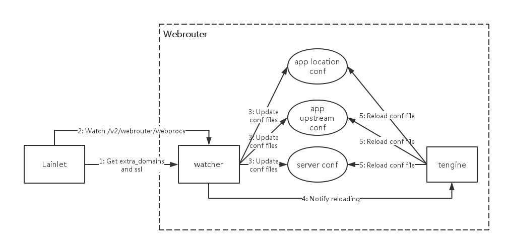

# Webrouter

## Introduction
作为LAIN中layer1的重要应用，Webrouter对外提供了对集群内应用的HTTP/HTTPs的访问功能，是外部客户端访问LAIN中Web应用的唯一入口。所有访问`http://mountpoint/location`和`https://mountpoint/location`的请求都会发送到Webrouter中，并转发至其配置的upstream。

Webrouter的特性：
- 及时更新Upstream：Webrouter能够及时根据应用的web proc中配置的mountpoint更新upstream配置文件。
- HTTPs支持：如果对于安全性要求较高，强烈推荐在lain集群中开启HTTPs功能。Webrouter支持根据自己的域名证书接受HTTPs的请求。
- 完善的访问日志收集与查询：Webrouter会详细记录所有的访问日志。如果集群配置了**kafka**，可以在**kafka**中查询到访问每个upstream的日志。
- 支持主备：当部署的Webrouter的实例个数大于1时，LAIN的networkd组件会自动监听所有的Webrouter实例的工作状态，并将Webrouter的虚拟IP绑定到某一个正常工作的Webrouter实例所在的节点上。如果该实例出现问题，networkd也会及时地将该虚拟IP迁移到正常的容器所在的节点上。Webrouter各个实例之间则不会相互影响。

> Webrouter依赖的组件：
> - lainlet（必需）
> - networkd（必需）
> - rebellion （可选，日志收集）
> - kafka （可选，日志收集查询）
> - graphite (可选，配置文件语法合法性监控)

## Architecture
Webrouter是由Supervisor实现进程管理的，实际工作的进程包括[tengine](http://tengine.taobao.org/)和watcher：
- **tengine**:  负责处理HTTP/HTTPs请求。
- **watcher**: 负责监听集群应用的web proc的mountpoint变化，更新upstream的配置，并通知**tengine** reload配置。同时还会定期检测所有配置文件的语法合法性，防止刷新时出现中间状态导致配置失效。如果配置了监控系统，**watcher**还会将检查结果以及更新配置的结果发送到监控系统。

Webrouter的工作流程如下图：

其工作流程为：

1.  **watcher**从lainlet中获取`extra_domains`和`ssl`的配置信息。

1.  监听**lainlet**的`/v2/webrouter/webprocs`接口。当有应用的web proc更新时， **watcher**会从监听中获得web proc的`containerIP`，`expose`和`mountpoint`。

1.  **watcher**根据1和2中的数据生成新的**tengine**配置文件。

    > 生成配置文件在`/etc/nginx/`下，包括以下三类：
    > - server: 定义了`appname.domain`以及 web proc的`mountpoint`里写的域。同时还包括访问该`appname.domain`时，是否支持HTTPs，如果支持则还指定了证书位置。文件位置为`conf.d/appname.domain.conf`。
    > - upstream: 定义了`appname.domain`以及 web proc的`mountpoint`里写的域。同时还包括访问该`appname.domain`时，是否支持HTTPs，如果支持则还指定了证书位置。文件位置为`upstreams/appname.upstreams`。
    > - location: 针对lain.yaml中配置的`mountpoint`，定义了访问该`mountpoint`时实际对应的upstream，以及相应的访问日志位置。文件位置为`locations/mountpoint/upstream_name`。

1.  **watcher**通知**tengine**重新加载DNS配置文件，并重新进入监听状态。

1.  **tengine**重新加载配置文件，更新完成。

## License
Webrouter遵循[MIT](https://github.com/laincloud/webrouter/blob/master/LICENSE)开源协议.
